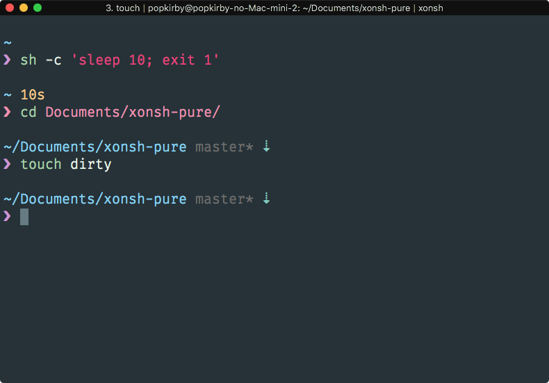

# xonsh-pure

> Port of the [`pure`](https://github.com/sindresorhus/pure) ZSH theme to [Xonsh](https://xon.sh/)



## Install

Install this repository as pip package:

```sh
$ pip install git+https://github.com/popkirby/xonsh-pure
```

And then load in your `.xonshrc`:

```python
xontrib load pure
```

## Configuration

```python
# Max execution time of a process before its run time is shown when it exits
$PURE_CMD_MAX_EXEC_TIME = 5
```

## License

MIT

